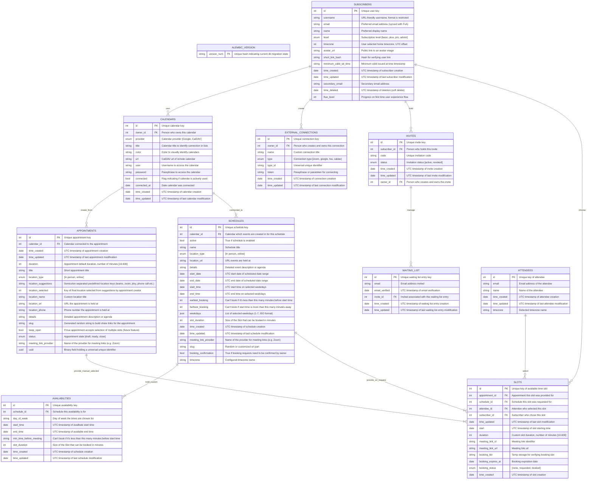

# Documentation Thunderbird Appointment

This place holds all additional technical documentation for Thunderbird Appointment.

## API endpoints

After starting the backend container, you can find the API documentation here: <http://localhost:8090/docs>

## Project architecture

This are the general components, Thunderbird Appointment consists of.

## Entity relations

The database contains the following tables and columns.

